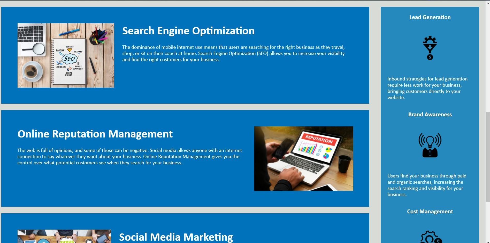
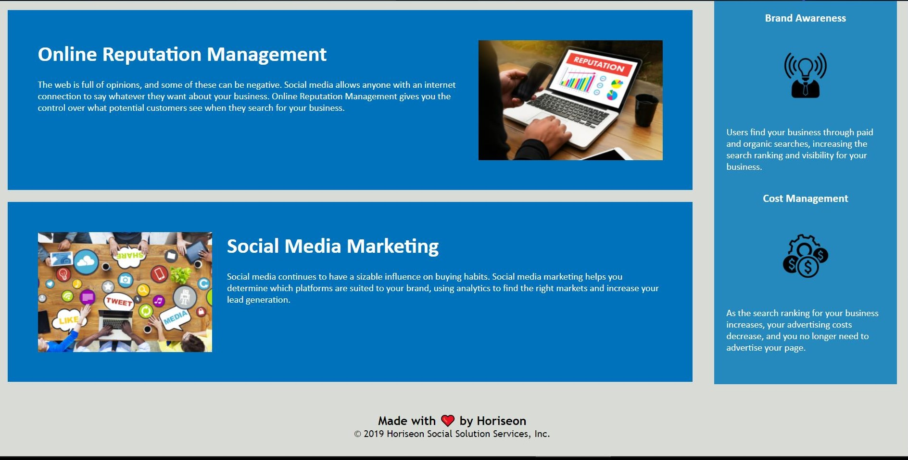

# Horiseon code refactor project

## Requirements

GIVEN a webpage meets accessibility standards
WHEN I view the source code
THEN I find semantic HTML elements
WHEN I view the structure of the HTML elements
THEN I find that the elements follow a logical structure independent of styling and positioning
WHEN I view the image elements
THEN I find accessible alt attributes
WHEN I view the heading attributes
THEN they fall in sequential order
WHEN I view the title element
THEN I find a concise, descriptive title

## Files & directories

-horiseon-code-refactor
    -Develop
      -assets
        -css
          -style.css
        -images
          -brand-awareness.png
          -cost-management.png
          -digital-marketing-meeting.jpg
          -lead-generation.png
          -online-reputation-management.jpg
          -search-engine-optimization.jpg
          -social-media-marketing.jpg
      -index.html
    -.gitignore
    -horiseon1.jpg
    -horiseon2.jpg
    -horiseon3.jpg
    -README.md

## Project Notes

this webpage html has been refactored to include sematic elements, and css styles consolidated.
i have added comments, alt attributes, and reconfigured the flow of the page to meet quality and accessibility standards.

## Screenshots

## Link

[link](https://valiantthor92.github.io/horiseon-code-refactor/)

## Credits

-Travis Nelson (student)